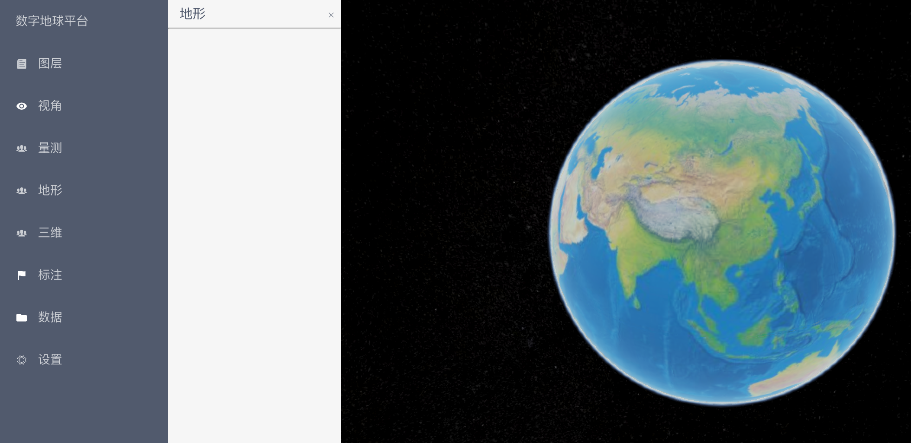
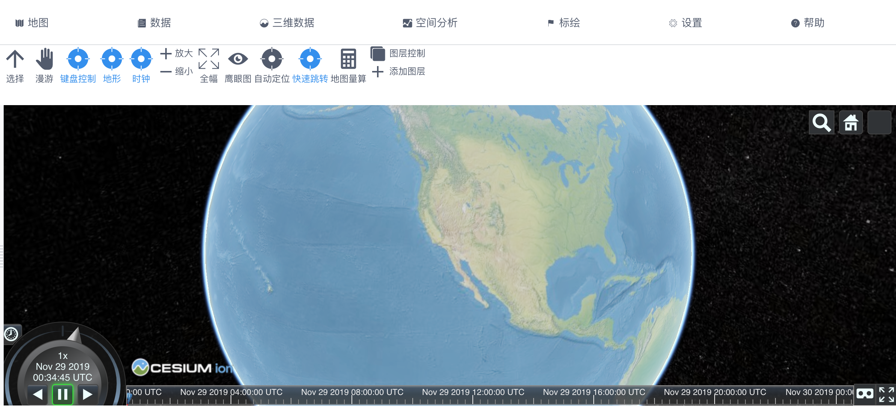

# vue-cesium-platform
Vue结合Cesium的web端GIS平台


## 特性

-  Vue构建界面
- 集成GIS基础功能


## 快速开始

 下载源码，在根目录执行

- 安装依赖

```shell
npm install
```

- 运行

```shell
npm run dev
```


访问

http://127.0.0.1:3001

## 界面


第一版界面(该界面已废弃)





第二版界面(Ribbon风格)




## CHANGELOG

[CHANGELOG](CHANGELOG.md)


https://github.com/zouyaoji/vue-cesium


## FAQ 问答


## 参考

Ribbon https://baike.baidu.com/item/Ribbon/17568

vue-cesium https://github.com/zouyaoji/vue-cesium


## 联系我

知乎 https://www.zhihu.com/people/YafengTony/


## 其他

我的知乎文章 https://www.zhihu.com/people/YafengTony/posts

我的GitHub https://github.com/yafengstark

我的小专栏 https://xiaozhuanlan.com/u/9953907774