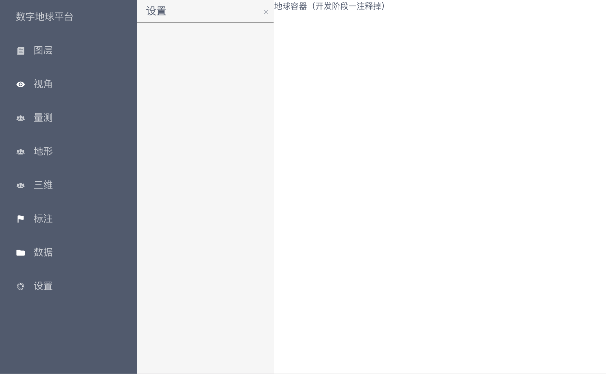

# vue-cesium-platform
Vue结合Cesium的web端gis平台


## 初步效果


> 笔记本性能限制，运行Cesium温度飙到70度以上。所以平时开发时先开发界面，之后加载Cesium地球




## 当前实现的功能

- 组件化，模块功能分工
- 集成Cesium
- 操作面板可切换
- 操作面板增加关闭按钮


## 接下来待实现

- 具体功能

- 用户登录

- 标注

  

  

涉及后端，后端将开源，springboot+mysql)


不定期会更新源码；


## 思路

- 要懂Vue相关的知识，组件化开发，vuex, vue-router
- 参考[zouyaoji vue-cesium](https://github.com/zouyaoji/vue-cesium)


## 源码及如何运行

 下载源码，在根目录执行

- 安装依赖

```shell
npm install
```

- 运行

```shell
npm run dev
```


[源码](https://github.com/yafengstark/vue-cesium-platform)


觉得不错，欢迎点star哦！视情况更新。